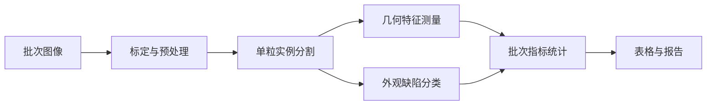

# RiceVision-QI

面向稻米外观品质检测的桌面应用原型。项目使用 PySide6 构建检测工作台，目标是将图像导入、单粒分割、几何统计、缺陷分类和报告导出组织为可复现的离线检测流程。

> 当前默认分支已形成可运行的 OpenCV 检测基线，覆盖 ROI、分割、几何测量、规则分类和调试视图。国标指标、正式报告及真实数据精度验证仍在开发中，本仓库不宣称已经达到生产或标准检验精度。

## 研究方向

- 稻米单粒实例分割
- 粒长、粒宽、长宽比和完整度测量
- 完整粒、碎米及外观缺陷分类
- 批次级统计与可追溯结果导出
- 传统图像处理与轻量分割模型的对照实验

## 当前能力

- PySide6 四区域桌面布局
- JPG、PNG、BMP、TIF/TIFF 图像导入
- 保持纵横比的图像显示
- 检测任务类型选择
- 阈值、Watershed 和边缘增强 Watershed 分割后端
- ROI 内检测及原图坐标映射
- 单粒几何测量、基础规则分类和结果叠加
- 中间掩膜、分水岭标记和结果图调试视图
- 参数调优、算法对比和 YOLO 分割数据评估工具
- 单粒结果表、批次统计及人工复核入口
- 51 项自动化测试

## 待完成能力

- 像素到毫米的相机标定
- 面向真实缺陷的类别与标签规范
- GB/T 指标计算和报告生成
- 固定真实数据集上的准确率与重复性验证
- YOLO-seg 权重训练和现场数据验证

## 快速开始

需要 Windows 和 Python 3.10+。

```powershell
git clone https://github.com/orge-e/RiceVision-QI.git
cd RiceVision-QI

conda create -n ricevision-qi python=3.11 -y
conda activate ricevision-qi
python -m pip install -r requirements.txt
python run_app.py
```

## 算法验证

默认配置使用 OpenCV 基线，YOLO-seg 作为可选后端。参数调优示例：

```powershell
python -m ricevision_qi.app.tools.segmentation_tuner `
  --image samples/raw/test.jpg `
  --output samples/output/tuning
```

在带 YOLO 多边形标注的数据集上比较不同配置：

```powershell
python -m ricevision_qi.app.tools.yolo_seg_evaluator `
  --dataset <YOLO数据集目录> `
  --split valid `
  --output samples/output/yolo_seg_eval `
  --profiles dense_rice_cluster yolo_seg_rice
```

生成的掩膜、叠加图、CSV 和评估报告位于 `samples/output/`，不提交到仓库。

## 规划流程



## 验证

```powershell
python -m pytest
```

后续验收将区分软件测试与真实检测指标。真实指标至少包括实例分割 Precision/Recall、粒长粒宽误差、分类混淆矩阵、批次统计偏差和单图耗时。

## 数据说明

仓库不应提交原始实验图片、个人环境导出文件、大型模型权重或未脱敏的检测报告。建议通过发布页或外部模型仓库存放权重，并在仓库中保留校验值与下载说明。

## 项目状态

该项目已经具备可复现的软件检测基线，适合作为稻米品质视觉检测研究原型继续开发。当前结果主要证明软件链路与实验工具可运行，真实检测精度仍以未来固定数据集评估为准。
