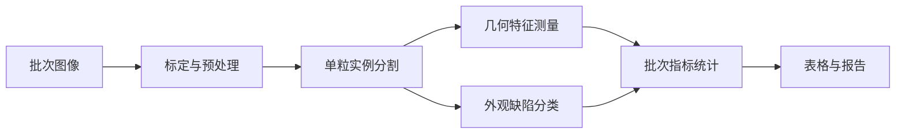

# RiceVision-QI

面向稻米外观品质检测的桌面应用原型。项目使用 PySide6 构建检测工作台，目标是将图像导入、单粒分割、几何统计、缺陷分类和报告导出组织为可复现的离线检测流程。

> 当前默认分支处于基础工作台阶段：界面布局与图像导入可用，检测算法、国标指标计算和正式报告仍在开发中。本仓库不宣称已经达到生产或标准检验精度。

## 研究方向

- 稻米单粒实例分割
- 粒长、粒宽、长宽比和完整度测量
- 完整粒、碎米及外观缺陷分类
- 批次级统计与可追溯结果导出
- 传统图像处理与轻量分割模型的对照实验

## 当前能力

- PySide6 四区域桌面布局
- JPG、PNG、BMP、TIF/TIFF 图像导入
- 保持纵横比的图像显示
- 检测任务类型选择
- 单粒结果表与批次统计界面骨架
- 自动化测试入口

## 待完成能力

- 单粒分割与粘连分离
- 像素到毫米的相机标定
- 缺陷类别及标签规范
- GB/T 指标计算和报告生成
- 固定真实数据集上的准确率与重复性验证

## 快速开始

需要 Windows 和 Python 3.10+。

```powershell
git clone https://github.com/orge-e/RiceVision-QI.git
cd RiceVision-QI

conda create -n ricevision-qi python=3.11 -y
conda activate ricevision-qi
python -m pip install -r requirements.txt
python run_app.py
```

## 规划流程



## 验证

```powershell
python -m pytest
```

后续验收将区分软件测试与真实检测指标。真实指标至少包括实例分割 Precision/Recall、粒长粒宽误差、分类混淆矩阵、批次统计偏差和单图耗时。

## 数据说明

仓库不应提交原始实验图片、个人环境导出文件、大型模型权重或未脱敏的检测报告。建议通过发布页或外部模型仓库存放权重，并在仓库中保留校验值与下载说明。

## 项目状态

该项目适合作为稻米品质视觉检测的研究原型继续开发；在检测算法与真实数据评估完成前，不建议作为简历中的首要成品项目。
